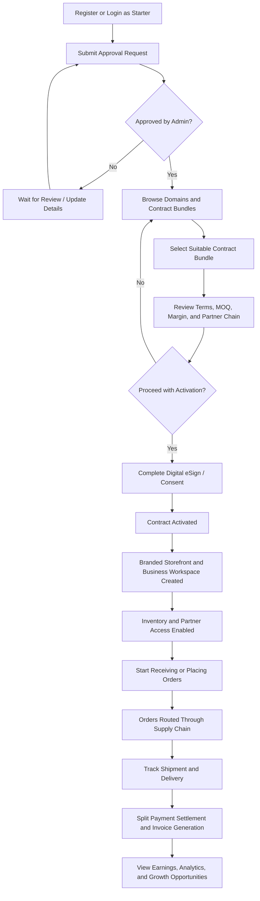

# ContractChain Hub
## A B2B Multi-Domain Supply Chain Management System Enabling Individuals to Launch New Businesses Through Pre-Vetted Supply Chain Contracts

**Project Report**  
Prepared for: Academic Submission / Portfolio / Startup MVP  
Date: April 2026

## 1. Abstract
ContractChain Hub is a web-based B2B multi-domain supply chain management platform designed to help individuals launch new businesses by joining existing supply chains through pre-vetted digital contracts. Instead of spending weeks negotiating with suppliers, arranging inventory, and building operations from scratch, a new user can sign up as a `Starter`, browse approved contract bundles, activate them through digital consent workflows, and immediately access a structured business network.

The platform combines a contract marketplace, role-based supply chain participation, order and inventory management, shipment tracking, digital payments, and analytics inside a single ecosystem. It is built to support multiple domains such as agriculture, food products, pharmaceuticals, e-commerce goods, and warehouse-linked logistics services. The system is especially relevant for regional entrepreneurship models, including Kerala-focused product ecosystems, where small businesses often struggle to access trustworthy suppliers and operational infrastructure.

ContractChain Hub addresses this gap by offering a "Supply Chain as a Service" model. It enables new entrants to become distributors, resellers, or retail operators by activating ready-to-use supply chain contracts rather than building every partnership manually. The result is a faster, lower-risk, and more accessible path to entrepreneurship.

## 2. Existing System
Current B2B and supply chain platforms solve only fragments of the real problem faced by new business entrants.

### 2.1 Marketplace Platforms
Platforms such as IndiaMART, Udaan, and TradeIndia mainly provide discovery and lead generation. Businesses can browse suppliers and products, but they still need to:
- negotiate price manually
- confirm minimum order quantities
- verify supplier trustworthiness
- draft contracts separately
- manage logistics and follow-up outside the platform

These systems are useful as listing directories, but they do not provide an instant business-launch path.

### 2.2 Enterprise Procurement and Contract Suites
Systems like SAP Ariba and Icertis are powerful but designed for large enterprises. They are:
- costly to deploy
- complex to configure
- process-heavy
- unsuitable for solo founders, early-stage operators, or small regional businesses

### 2.3 Logistics-Only Solutions
Transport and shipment systems focus on delivery visibility, route tracking, or warehousing. They do not solve upstream business creation problems such as:
- supplier onboarding
- contract activation
- role-based entry into a supply chain
- instant storefront or distribution setup

### 2.4 Key Limitations in the Existing System
- High entry barriers for individuals who want to start a business.
- Separate tools for contracts, inventory, payments, logistics, and analytics.
- No plug-and-play ecosystem for joining an existing supply chain.
- Weak support for small, regional, and multi-domain business creation.
- Delayed time-to-launch due to fragmented workflows and manual approvals.

## 3. Proposed System
ContractChain Hub introduces a unified platform where supply chain participation, business onboarding, contract activation, and operations management exist in one connected system.

### 3.1 Core Idea
An individual who wants to start a business registers on the platform as a `Starter`, requests approval, and after verification gains access to a curated ecosystem of pre-approved companies, contract bundles, and business pathways. The user can then select business partners and activate legally prepared agreements to build a new supply chain for their venture.

### 3.2 Supply Chain as a Service for Individuals
The proposed system treats supply chain participation as a service layer. Instead of asking a new entrepreneur to negotiate independently with producers, manufacturers, warehouses, and distributors, the platform provides:
- pre-vetted business partners
- domain-wise contract bundles
- standardized pricing and MOQ rules
- digital activation workflows
- integrated inventory, ordering, and shipping visibility

### 3.3 Role Model
The platform supports six primary roles:

1. `Starter`
   Launches a new business by selecting approved contracts and supply chain partners.

2. `Producer`
   Supplies raw materials or source goods and creates upstream contracts.

3. `Manufacturer`
   Converts materials into finished or semi-finished products and publishes production-linked contracts.

4. `Distributor`
   Handles bulk movement, stocking, and regional distribution.

5. `Retailer`
   Purchases from upstream partners and resells through B2B or retail channels.

6. `Admin`
   Verifies users, approves business access, moderates contracts, and maintains compliance.

### 3.4 Key Functional Features
- Contract marketplace with domain-specific bundles.
- Admin approval before business users gain partner access.
- Digital contract activation with Aadhaar eSign integration in production deployment.
- Real-time inventory, order, and shipment visibility.
- Integrated payment flows with split settlement and escrow support.
- GST-compliant invoicing and transaction records.
- Role-based dashboards for every participant in the supply chain.
- Business analytics for sales, orders, earnings, delays, and margins.

## 4. Hardware Requirements
### 4.1 Client-Side
- Desktop, laptop, tablet, or smartphone with internet access
- Minimum 4 GB RAM
- Dual-core processor or better
- Stable broadband or mobile internet
- Latest Chrome, Edge, or Firefox browser

### 4.2 Server-Side
For MVP deployment:
- 2 vCPU
- 4 GB RAM
- 50 GB SSD

For production deployment:
- 4 or more vCPU
- 8 GB or more RAM
- 100 GB or more SSD
- Managed PostgreSQL instance
- Redis cache layer

No specialized hardware is required. Mobile cameras can be used for QR or barcode scanning in lightweight operational scenarios.

## 5. Software Requirements
- **Frontend:** Next.js 15, TypeScript, Tailwind CSS
- **Backend:** Next.js API Routes or NestJS on Node.js
- **Database:** PostgreSQL with Prisma ORM
- **Authentication:** Clerk or NextAuth.js with role-based access control
- **Realtime:** Socket.io or Supabase Realtime
- **Payments:** Razorpay for subscriptions, split settlements, escrow, and UPI support
- **Digital Signatures:** Aadhaar eSign integration through a licensed provider such as eMudhra
- **Mapping and Tracking:** Mapbox
- **Invoicing:** `pdf-lib` or server-side PDF generation tools
- **Caching and Queueing:** Redis
- **Hosting:** Vercel for frontend, Railway/Render or equivalent for backend and database
- **Compliance Support:** GST e-invoice support, IT Act 2000 aligned eSign workflows

## 6. ER Diagram

```mermaid
erDiagram
    USER {
        uuid id PK
        string role
        string name
        string email
        string phone
        string aadhaar
        string business_name
        string gst_number
        string address
    }

    CONTRACT {
        uuid id PK
        uuid creator_id FK
        string domain
        decimal margin_percentage
        int moq
        int lead_time_days
        string status
        date expiry_date
        string esign_url
        jsonb terms
    }

    PRODUCT {
        uuid id PK
        uuid contract_id FK
        string name
        string description
        decimal price
        int stock_quantity
        string image_url
    }

    STORE_ORDER {
        uuid id PK
        uuid buyer_id FK
        uuid contract_id FK
        decimal total_amount
        string status
        timestamp created_at
    }

    ORDER_ITEM {
        uuid id PK
        uuid order_id FK
        uuid product_id FK
        int quantity
        decimal price_at_purchase
    }

    PAYMENT {
        uuid id PK
        uuid order_id FK
        decimal amount
        string razorpay_id
        string status
        decimal platform_fee
    }

    SHIPMENT {
        uuid id PK
        uuid order_id FK
        string tracking_id
        string status
        string pod_url
    }

    INVENTORY {
        uuid id PK
        uuid product_id FK
        uuid owner_id FK
        int available_stock
        int reserved_stock
        string location
    }

    USER ||--o{ CONTRACT : creates
    USER ||--o{ STORE_ORDER : places
    CONTRACT ||--o{ PRODUCT : includes
    CONTRACT ||--o{ STORE_ORDER : activates
    STORE_ORDER ||--o{ ORDER_ITEM : contains
    PRODUCT ||--o{ ORDER_ITEM : referenced_by
    STORE_ORDER ||--|| PAYMENT : generates
    STORE_ORDER ||--|| SHIPMENT : tracked_by
    PRODUCT ||--o{ INVENTORY : stocked_in
```

## 7. Use Case Diagram
### Actors
- Starter
- Producer
- Manufacturer
- Distributor
- Retailer
- Admin
- Buyer or Customer (external)

### Major Use Cases
- Register and request platform approval
- Browse approved companies and contract bundles
- Activate a contract and launch a business
- Create producer or manufacturer contracts
- Manage inventory and order fulfillment
- Route shipments and upload proof of delivery
- Process payments, split settlements, and invoices
- Monitor dashboard analytics
- Approve users, contracts, and compliance workflows

### Central Use Case
The core use case of the system is:

`Activate Contract and Launch Business`

This is the action that differentiates the platform from ordinary B2B marketplaces.

## 8. Activity Diagram
### Starter Launches a New Business Using Supply Chain Contracts

## 9. Database Tables
### Core PostgreSQL Tables

| Table Name | Purpose | Main Fields |
|---|---|---|
| `users` | Stores all platform users and roles | `id`, `role`, `name`, `email`, `phone`, `aadhaar`, `business_name`, `gst_number` |
| `contracts` | Stores reusable business contracts and bundles | `id`, `creator_id`, `domain`, `margin_percentage`, `moq`, `lead_time_days`, `terms`, `status` |
| `products` | Products available under a contract | `id`, `contract_id`, `name`, `description`, `price`, `stock_quantity` |
| `store_orders` | Orders placed by Starters, retailers, or distributors | `id`, `buyer_id`, `contract_id`, `total_amount`, `status`, `created_at` |
| `order_items` | Product-level order details | `id`, `order_id`, `product_id`, `quantity`, `price_at_purchase` |
| `payments` | Tracks transaction status and revenue split | `id`, `order_id`, `amount`, `status`, `platform_fee` |
| `shipments` | Delivery and proof-of-delivery tracking | `id`, `order_id`, `tracking_id`, `status`, `pod_url` |
| `inventory` | Stock visibility across roles and locations | `id`, `product_id`, `owner_id`, `available_stock`, `reserved_stock`, `location` |
| `notifications` | Alerts for approvals, orders, delays, and settlements | `id`, `user_id`, `title`, `message`, `status` |
| `analytics_snapshots` | Stores summarized dashboard metrics | `id`, `user_id`, `metric_type`, `value`, `captured_at` |

### Suggested Extended Tables
- `company_profiles`
- `contract_activations`
- `invoice_records`
- `supplier_relationships`
- `shipment_events`
- `audit_logs`
- `wallet_transactions`

## 10. Advantages
- Low entry barrier for individuals who want to start a B2B business.
- Faster launch because contract discovery, approval, and activation happen in one platform.
- Trusted ecosystem through admin-verified companies and structured partner access.
- End-to-end supply chain visibility from sourcing to delivery.
- Secure payment flow with settlement control and escrow-ready design.
- Better compliance through invoicing, audit trails, and structured contract records.
- Multi-domain support with potential regional specialization such as Kerala products.
- Strong portfolio and startup value because the model is both technically rich and commercially meaningful.

## 11. Conclusion
ContractChain Hub redefines how new entrepreneurs enter B2B commerce by shifting the problem from "build an entire business network from scratch" to "activate an approved business pathway inside a trusted ecosystem." This makes supply chain participation faster, safer, and more inclusive.

The platform is technically feasible with modern web technologies, commercially valuable as a SaaS or transaction-based product, and academically strong because it combines real business need, system design, role-based modeling, database architecture, digital contracts, and operational workflows in one project.

Its strongest innovation is not only supply chain visibility, but supply chain accessibility. By allowing individuals to launch businesses through pre-vetted contracts and approved partners, the platform lowers the barrier to entrepreneurship while maintaining control, traceability, and operational discipline.

## Future Enhancements
- AI-based contract and supplier recommendations
- Demand forecasting and automated replenishment suggestions
- Blockchain-backed contract audit trails
- Native mobile application for operations and onboarding
- Multi-language support for regional adoption
- International partner expansion for export-ready ecosystems
