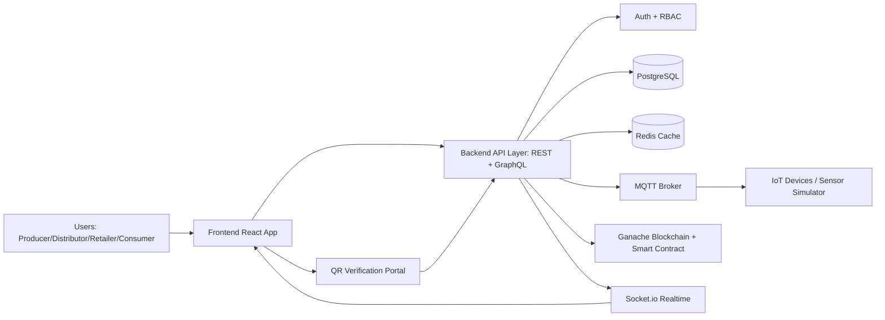

# ChainTrace - Simple PowerPoint Content

Use one section below per slide.

## Slide 1 - Abstract
- ChainTrace is a multi-domain supply chain traceability platform using blockchain, IoT, AI, and analytics.
- It supports Agriculture, Pharmaceutical, Food Safety, E-commerce authenticity, and Warehouse IoT in one system.
- Each product event is recorded with verifiable history, improving trust, recall response, and compliance.
- The project is configured for college-friendly testing using Ganache + Hardhat (no live gas fees).

## Slide 2 - Introduction
- Supply chains are fragmented across producers, transporters, warehouses, retailers, and consumers.
- Lack of shared trusted records causes counterfeit risk, weak recall management, and audit delays.
- ChainTrace provides a unified digital backbone for product lifecycle visibility from origin to end user.
- The platform combines web dashboards, QR verification, smart contracts, and real-time sensor data.

## Slide 3 - Existing System
- Conventional systems are mostly centralized and organization-specific.
- Data is stored in silos (ERP sheets, local DBs, manual logs).
- Cross-organization traceability is limited and hard to verify.
- Consumer-side authenticity verification is often unavailable or unreliable.

## Slide 4 - Drawbacks of Existing System
- No immutable proof of records; risk of tampering or disputes.
- Slow product recall and compliance reporting.
- Poor real-time monitoring of temperature/humidity and logistics anomalies.
- Limited visibility for regulators, auditors, and consumers.
- Higher losses due to counterfeit, expiry, and inventory mismatch.

## Slide 5 - Proposed System
- Register products with domain-specific metadata and certificates.
- Add journey checkpoints with location, timestamp, and optional IoT evidence.
- Anchor critical events with blockchain transaction hashes.
- Provide consumer verification via product ID / QR interface.
- Show dashboards with domain analytics, AI insights, and 3D warehouse visualization.

## Slide 6 - Advantages
- End-to-end traceability across five industry domains.
- Tamper-evident event history using blockchain.
- Faster recall operations and audit readiness.
- Better inventory and quality decisions using analytics and IoT streams.
- Scalable architecture (REST + GraphQL + WebSocket + PostgreSQL).

## Slide 7 - Modules (User Roles & Responsibilities)
- Super Admin: platform-level setup, contracts, and governance.
- Organization Admin: user management, company-level operations, reports.
- Producer/Manufacturer: product registration, origin checkpoint, certificate uploads.
- Distributor/Transporter: transit checkpoint updates and shipment evidence.
- Retailer/Store: receive and close delivery lifecycle.
- Quality Inspector: quality checks, compliance observations, approvals/rejections.
- Auditor: read-only traceability and compliance exports.
- Consumer: public product verification and issue reporting.

## Slide 8 - Frontend and Backend Stacks
- Frontend: React 18 + TypeScript, Tailwind CSS, Zustand, Recharts, Three.js, Mapbox GL, Framer Motion.
- Backend: Node.js + Express, REST + GraphQL (Apollo), Socket.io, JWT auth, Zod validation.
- Data Layer: PostgreSQL (main), Redis (cache/realtime support), MQTT integration for IoT feed.
- Blockchain: Solidity smart contracts, Hardhat toolchain, Ganache local test network, ethers.js.

## Slide 9 - Minimum Hardware and Software Requirements
- Hardware:
  - CPU: Intel i5 / Ryzen 5 or above
  - RAM: 8 GB minimum (16 GB recommended)
  - Storage: 20 GB free space (SSD recommended)
- Software:
  - OS: Windows 10/11 or Linux/macOS
  - Node.js 20+ and npm 10+
  - PostgreSQL 16+, Redis 7+, Ganache, and optional Mosquitto MQTT broker
  - Browser: Chrome/Edge (for MetaMask and WebGL features)

## Slide 10 - DFD (Data Flow Diagram)

- Detailed PPT-style DFD drawing pack: `docs/developer/chaintrace-dfd-ppt-pack.md`

## Slide 11 - Tables (Core 11 with Structure)
| Table Name | DataType (Key Fields) | Constraints | Description |
|---|---|---|---|
| `companies` | `id TEXT`, `company_code TEXT`, `domain TEXT`, `metadata JSONB`, `created_at TIMESTAMPTZ` | `PRIMARY KEY(id)`, `UNIQUE(company_code)`, domain/status `CHECK` | Master company registry for all domains. |
| `agriculture_companies` | `company_id TEXT`, `farm_count INTEGER`, `primary_crops JSONB`, `soil_profile JSONB` | `PRIMARY KEY(company_id)`, `FK -> companies(id)` | Agriculture-specific company profile data. |
| `pharmaceutical_companies` | `company_id TEXT`, `gmp_certified BOOLEAN`, `storage_temp_min_c DOUBLE`, `storage_temp_max_c DOUBLE` | `PRIMARY KEY(company_id)`, `FK -> companies(id)` | Pharma compliance and cold-chain profile data. |
| `food_safety_companies` | `company_id TEXT`, `fssai_license_no TEXT`, `iso_22000_certified BOOLEAN`, `haccp_certified BOOLEAN` | `PRIMARY KEY(company_id)`, `FK -> companies(id)` | Food safety certifications and processing controls. |
| `ecommerce_companies` | `company_id TEXT`, `marketplace_type TEXT`, `seller_verification_level TEXT`, `supported_regions JSONB` | `PRIMARY KEY(company_id)`, `FK -> companies(id)` | E-commerce authenticity and seller controls. |
| `warehouse_iot_companies` | `company_id TEXT`, `warehouse_count INTEGER`, `sensor_types JSONB`, `robotics_enabled BOOLEAN` | `PRIMARY KEY(company_id)`, `FK -> companies(id)` | Warehouse/IoT capability profile per company. |
| `users` | `id TEXT`, `email TEXT`, `password_hash TEXT`, `role TEXT`, `created_at TIMESTAMPTZ` | `PRIMARY KEY(id)`, `UNIQUE(email)`, role `CHECK` | Application users with RBAC roles. |
| `products` | `id TEXT`, `product_id TEXT`, `domain TEXT`, `metadata JSONB`, `certifications JSONB`, `status TEXT` | `PRIMARY KEY(id)`, `UNIQUE(product_id)`, domain/status `CHECK` | Product master and traceability metadata. |
| `checkpoints` | `id TEXT`, `product_id TEXT`, `checkpoint_type TEXT`, `iot_payload JSONB`, `created_at TIMESTAMPTZ` | `PRIMARY KEY(id)`, `FK -> products(product_id)`, type `CHECK` | Journey events captured through supply chain stages. |
| `audit_logs` | `id BIGSERIAL`, `actor_id TEXT`, `action TEXT`, `resource_type TEXT`, `metadata JSONB` | `PRIMARY KEY(id)` | Immutable-style activity and compliance trail. |
| `sensor_readings` | `id BIGSERIAL`, `product_id TEXT`, `sensor_type TEXT`, `temperature DOUBLE`, `humidity DOUBLE`, `created_at TIMESTAMPTZ` | `PRIMARY KEY(id)` | Time-series-like IoT environmental readings. |

## Slide 12 - Conclusion
- ChainTrace addresses transparency, authenticity, and operational visibility gaps in current supply chains.
- The project is practical for academic demonstration and extensible to real deployments.
- Current implementation provides a strong functional base: multi-domain model, blockchain-ready flow, and PostgreSQL-driven schema.
- Next growth areas: advanced AI models, richer QR camera integration, and broader enterprise connectors.
